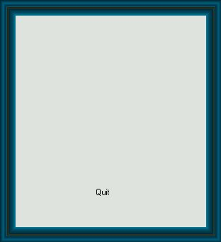



## Coloring Form

### Description

How to give color to your forms. I'm not speaking english so explications are in french.

Don't forget the vote :-)
 
### More Info
 

             |
---                |---
**Submitted On**   |2002-03-17 09:31:54
**By**             |[Jacques  Paraglider](https://github.com/Planet-Source-Code/PSCIndex/blob/master/ByAuthor/jacques-paraglider.md)
**Level**          |Beginner
**User Rating**    |4.7 (117 globes from 25 users)
**Compatibility**  |VB 5\.0, VB 6\.0
**Category**       |[Graphics](https://github.com/Planet-Source-Code/PSCIndex/blob/master/ByCategory/graphics__1-46.md)
**World**          |[Visual Basic](https://github.com/Planet-Source-Code/PSCIndex/blob/master/ByWorld/visual-basic.md)
**Archive File**   |[Coloring\_F628013172002\.zip](https://github.com/Planet-Source-Code/jacques-paraglider-coloring-form__1-32766/archive/master.zip)

